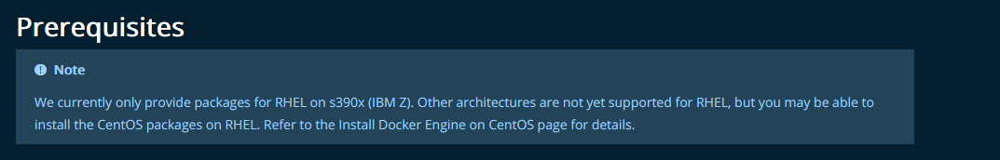
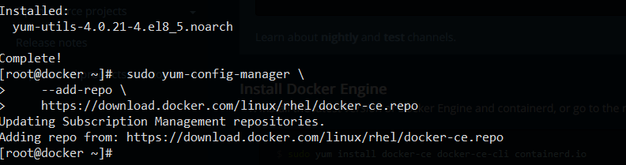
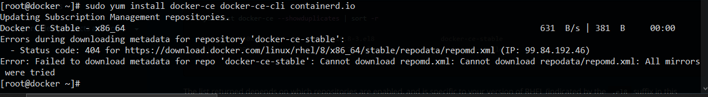
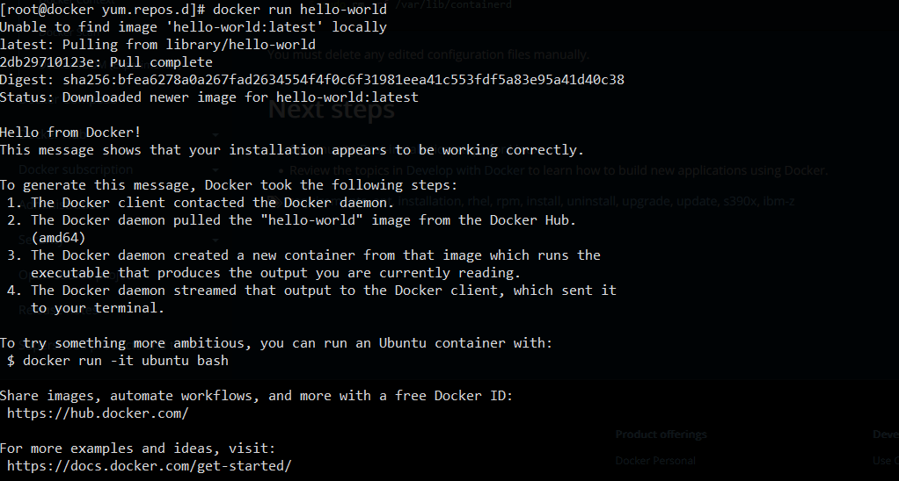

# Purpose: This will record the process of my build and configuration of docker and apache

## I merged apache and docker because they should be built on the same box

---

## Install Docker:
- I'm using my docker vm to do this, once I figure this out, I might make some more vms to try out swarm
  

- Not good, hope this is old
- found this:

https://crunchtools.com/how-to-install-docker-ce-on-rhel-8/

https://docs.docker.com/engine/install/rhel/

- They both seem to line up here it goes:

```bash
sudo yum remove docker \
                  docker-client \
                  docker-client-latest \
                  docker-common \
                  docker-latest \
                  docker-latest-logrotate \
                  docker-logrotate \
                  docker-engine \
                  podman \
                  runc
```

--> Found no matches

```bash
 sudo yum install -y yum-utils

 sudo yum-config-manager \
    --add-repo \
    https://download.docker.com/linux/rhel/docker-ce.repo
```

-->   
--> No problems

```
sudo yum install docker-ce docker-ce-cli containerd.io
```

  

--> Expected, never works the first time

--> Trying again... Same error

https://access.redhat.com/discussions/6249651

--> from this it looks like the repo urls are wrong, so:

```
sed -i 's/rhel/centos/g' docker-ce.repo
```

```
sudo yum install docker-ce docker-ce-cli containerd.io
```

--> It worked, docker seems to be installed even though not "fully" supported by RHEL 8, hope I don't get any strange errors...

## Just for Ref the version of Docker I'm using is:

```
Client: Docker Engine - Community
 Version:           20.10.14
 API version:       1.41
 Go version:        go1.16.15
 Git commit:        a224086
 Built:             Thu Mar 24 01:47:44 2022
 OS/Arch:           linux/amd64
 Context:           default
 Experimental:      true
```

- Trying out the docker commands I found from research to verify it works

--> starting deamon:

```
systemctl start docker
docker run hello-world
```

  

--> looks like it is working despite a few warnings in the service log. Going to go with it since I'm not doing anything heavy just apache.

## Install and Configure Apache

- Now is the part in which I need to figure out how to get my custom appache container built and then "contanierizerd"  so I can "automate" it on other servers...

- So it looks like from the instructions I need to build and configure my appache first with a bash script and then use a container file to deploy it.

- Going back to reseach to figure out best way to do this

https://github.com/docker-library/httpd

- This pulls a pre-built debian image and builds apache on top of this, this is interesting, but I think as per instructions, they would like me to take a VM "harden" and put apache on it and then convert that into a container...

https://linuxtechlab.com/create-docker-container-beginners-guide/

- Very basic, but it helps a little

https://medium.com/@vi1996ash/steps-to-build-apache-web-server-docker-image-1a2f21504a8e

- Okay, interesting thing here is that you can use a base "os" image and then bash shell into it after you build it and configure, if I can script bash this can be an opening for "serious" automation:

```
Step 7: Now we have container in which apache webserver is installed and our webpage is configured. We can make a new customized docker image from the stopped docker image using docker commit command. Docker commit command will build our own image.

#docker commit <container_id or name of container will launching> <Name of new image>:<version name>
```

- This is how you make a "new" Image

https://stackoverflow.com/questions/51835638/how-to-automate-docker-to-run-script-within-container-and-notify-completion-to-h

```
FROM alpine:latest

COPY ./build.sh /build.sh

VOLUME /data

CMD ["/build.sh", "/data/test.out"]
```

```
#!/bin/sh

sleep 5
echo "Hello world!" >> "$1"
exit 0 # docker run will exit with this code, you can use this to check if your build was successful

```

- These are a possible way to automate stuff with docker

https://docs.docker.com/engine/reference/commandline/exec/

- And you can use exec to run commands in container

https://gist.github.com/clcollins/68cd6b5a67a6124cafbf

- Bash Script for docker

https://www.cloudbees.com/blog/understanding-dockers-cmd-and-entrypoint-instructions

- Entry Point

## New Day (4/9/2022)

- Starting to build my apache dockerfile and config bash scripts (as defined in [flow.md](/Flow.md))

- Built up github so I can push/pull

## Docker Certs

- Playing around with Docker to see how to implemnt my x509 certs

- There is not default "/etc/pki/tls/", so it looks like I have to build this

- openssl is not installed

- So it looks like I will automate certs outside of the container and transfer

- see [Tutorials](./Docker.md#tutorials)

- Going to force TLS 1.2 for SSL since that's how it should be, this is also a stig item. You can find the ssl configs at: /usr/local/apache2/conf/extra and the httpd docker hub tells how to enable TLS, its going to require some ssl_config file changes, so do this and change the cert dir

- Researched and found how to generate my certs and change cert dirs, also I know how to implement TLS 1.2 for STIG compadablity, thus going to start my bash script now.

- Bash script is located in differnt repo, since I want to separte my notes and scripts (TODO, insert link)

- Built start.sh, testing 

```
# Run Docker
docker run -dit --name webs -p 80:80 -p 443:443 webserver:

```

- Had to work through a few things:
1. my cert names need to be "server.crt" and "server.key" for ssl config to work (I can change this but not right now)
2. That's really it, after that my docker file worked fine, was able to build and copy over tls certs, opened a web page with not issues and verified that the cert was the one I was using

- Now Building the config script that will configure Apache.

- Default location for web pages:

```
/usr/local/apache2/htdocs/
```

- Okay after troubleshooting a bunch I now have a working "config.sh" that enables ssl on docker apache, not much but going to branch off of this to continue configuration and STIGS


## Docker Config Script (Apache Config)

- Building part of config that will directly configure appache for custom dirs and ports, while also setting permissions

- Done, SSL, and custom dirs configured

- Now making custom port (Picking port 5555)
- Done, also discovered that port 80 was listening, so disabled it. Now we have a webserver that only hosts SSL/TLS at port 5555

- Now Implementing STIGs, I choose:
1. V-214253
2. V-214229
3. V-214269 
4. V-214246
5. V-214228

- All STIGS implemented, tested and working.

