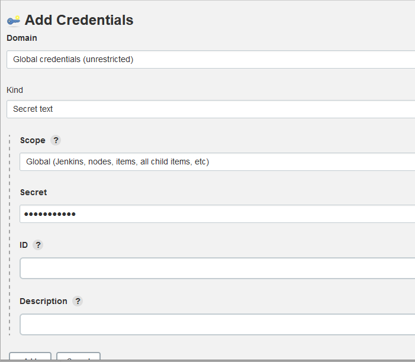

## Purpose: This will hold the fancy commands/info/thoughts and such I discover about Jenkins (from Research)

---

# Commands

view all environmental vars:
```
localhost:8080/env-vars.html/
```

# Terms

- Pipeline Core
- Pipeline based Job
- Nodes, Pipes, Pipe Syntax, Stages 
- Pipeline as code
- Infrastructure as Code

# Links

This is the jenkins doc, and this points to pipelines

https://www.jenkins.io/doc/book/pipeline/docker/

Jenkins tutorials, how tos

https://www.youtube.com/watch?v=2w-_JOK96Uc

Automatic Job (Building) based off of source changes:

https://wiki.jenkins.io/display/JENKINS/Building+a+software+project

Pass variable between stages in Jenkinsfile

https://stackoverflow.com/questions/43879733/jenkinsfile-declarative-pipeline-defining-dynamic-env-vars/43881731#43881731

Get output from script in Jenkinsfile

https://stackoverflow.com/questions/36547680/how-do-i-get-the-output-of-a-shell-command-executed-using-into-a-variable-from-j

**Jenkins Pipeline Script Deployment with Docker**

https://www.youtube.com/watch?v=gdbA3vR2eDs


Declarative Pipeline

https://www.jenkins.io/doc/book/pipeline/syntax/

Complete Jenkins Pipeline Tutorial

https://www.youtube.com/watch?v=7KCS70sCoK0

Add dockerhub account to Jenkins

https://blog.knoldus.com/
how-to-push-a-docker-image-to-docker-hub-using-jenkins/

## (CI/CD)

https://www.youtube.com/watch?v=gdbA3vR2eDs
https://www.jetbrains.com/teamcity/ci-cd-guide/continuous-integration/


## What is Continuous Deployment (CD)?

```
Continuous deployment takes the DevOps practice of automating build, test and deployment steps to its logical extreme. If a change to the code successfully passes all previous stages of the pipeline, that change is automatically deployed to production without any manual intervention. Adopting continuous deployment means you can get new features to your users as fast as possible, without compromising on quality.

Continuous deployment is underpinned by a mature, well-tested continuous integration and continuous delivery stages. Small code changes are regularly committed to master, put through an automated build and test process with promotion through various pre-production environments, and – if no issues are discovered – finally deployed to live. Building a robust and reliable automated deployment pipeline means releasing can become a non-event that takes place multiple times a day.

Although automating the final rollout to live is not appropriate for every software project, you can still benefit from some of the individual elements involved in implementing continuous deployment effectively. This article will explore what’s involved and what to bear in mind before taking this last step towards continuous everything.
```


## What is Continuous Integration (CI)?

```
Continuous integration, or CI as it’s often known, is the practice of having everyone working on the same software project share their changes to the codebase regularly and then checking that the code still works as it should after each change. Continuous integration forms a key part of the DevOps approach to building and releasing software, which promotes collaboration, automation and short feedback cycles.

Practicing continuous integration starts with committing changes to a source/version control system regularly so that everyone is building on the same foundation. Each commit triggers a build and a series of automated tests to verify the behavior and ensure the change has not broken anything. While continuous integration is beneficial by itself, it’s also the first step towards implementing a CI/CD pipeline.
```


# Sample Pipeline Config files

```powershell
node{
   stage('SCM Checkout'){
       git credentialsId: 'git-creds', url: 'https://github.com/javahometech/my-app'
   }
   stage('Mvn Package'){
     def mvnHome = tool name: 'maven-3', type: 'maven'
     def mvnCMD = "${mvnHome}/bin/mvn"
     sh "${mvnCMD} clean package"
   }
   stage('Build Docker Image'){
     sh 'docker build -t kammana/my-app:2.0.0 .'
   }
   stage('Push Docker Image'){
     withCredentials([string(credentialsId: 'docker-pwd', variable: 'dockerHubPwd')]) {
        sh "docker login -u kammana -p ${dockerHubPwd}"
     }
     sh 'docker push kammana/my-app:2.0.0'
   }
   stage('Run Container on Dev Server'){
     def dockerRun = 'docker run -p 8080:8080 -d --name my-app kammana/my-app:2.0.0'
     sshagent(['dev-server']) {
       sh "ssh -o StrictHostKeyChecking=no ec2-user@172.31.18.198 ${dockerRun}"
     }
   }
}

```
Basic Framework
```powershell
# In order to do creds in Jenkins you need two plugins:
# 1. Credentials
# 2. Credentails Binding

CODE_CHANGES = getGitChanges() # Not real, just for sample/example
pipeline { # This is a declaritive pipeline

  agent any # this can run on any instace of Jenkins (from a cluster)

  parameters { # inputs

    string(name: 'VERSION', defaultValue: '', description: 'hello')
    choice(name: 'VERSION', choices: ['1.1.0', '1.2.1', '1.3.3'], description: '')
    booleanParam(name: 'DEBUG', defaultvalue: false, description: '')


  }
  tools { # Access build tools for your projects, Jenkins only supports 3 tools atm by default!, but you can build your own tools as well!

    maven 'Maven' # Use GUI to get tool names


  }

  environment { # Build environment vars

    NEW_VERSION = '1.4.0'
    SERVER_CREDS = credentials('server_creds') # Use credentails binding plungin and define creds in Jenkins in order to refence in pipeline file

  }
  
  stages { # Where the work happens

    stage("build") { # Defeine diferent stages (build, deploy, test, etc)

        steps {
              echo 'Building APP!!!'
              echo "Building version ${NEW_VERSION}" 
              echo "the creds are ${SERVER_CRED}, this is unsecure!!!"
              

        }
    }

    stage ("test") {

        when { # only execute this stage if conditions are met

          expression { # You can use logic here

            env.BRANCH_NAME == 'dev' || env.BRANCH_NAME == 'master' && env.CODE_CHANGES == true

          }

        }
        steps {
              echo 'Testing APP!!!' 

              withCredentials([ # This allows you to apply creds in only one stage as a wrapper

                  usernamePassword(credentails: 'server_creds', usernameVarible: USER, passwordVariable: PWD) # "server_creds" is the creds you defined in Jenkins GUI. Store your username and pass in respective vars

              ]) {

                    sh "some script ${USER} ${PWD}"

              }

        }


    }

    stage ("deploy") {

      when {

          expression { # Use inputed parameters to do something

              params.DEBUG # If debug is set to true


          }

      }
      steps {

         #do stuff if when is satisfied (Like run debug statments)       
      }

    }
  }
  
  post { # Execute something after all stages are done

    always { # Always execute this code (send out a message to team)


    }

    success { # only execute if success


    }

    failure { # ditto but with fail 


    }

  }
}
```

# Tutorials

## Enable GitHub Polling for Reps (Regular Pipeline)


https://plugins.jenkins.io/github/#GitHubPlugin-GitHubhooktriggerforGITScmpolling

- This will allow for changes made to github repos to trigger new build jobs in Jenkins. Very useful for CI/CD, However this can also be done with multibranch pipelines.. so might want to check those out

- Requirements:
  - Git and Github plugins
  - Github webhooks (https://docs.github.com/en/developers/webhooks-and-events/webhooks/creating-webhooks), thus an internet facing something to recive "POST" calls from github
  - Note, this does not work with Multibranch piplines because they already are triggered by repo changes, however if you point this to a public repo you can be at a loss (since you need to put in your creds), thus if you want to only use your limited Personal Access Token, use regular pipelines

1. Go to "Manage Jenkins" --> Configure System:

    

2. Go to "GitHub" --> "GitHub Servers"

      

3. Insert your Name, leave API URL:

      

4. Create Github OAuth Token, make sure it has at least "admin:org_hook" scope, note you can use the git-hub's plugin to auto generate an auth token for you, but it looks skechy, thus going on github is better

5. Under "Credentials" enter your Token as a "Secret Text" cred:

      

6. Now Test Connect, you should see "Credentials verified":

--> By they, don't worry about your rate limit, it refreshes hourly 

      

7. Go to the job you want to setup, under "Configuration" --> "Build Triggers" you should select "GitHub hook trigger for GITScm polling"

      

8. As per the doc link above this is smart enough to only build if the current selected repo for the job updates. It is true that the auth token can be use for all repos under the user.


## Enable GitHub Polling for Reps (MultiBranch Pipeline)

https://stackoverflow.com/questions/61105368/how-to-use-github-personal-access-token-in-jenkins/61105369#61105369

0. Create your personal access token, these permisisons worked for me:

      
1. Build a new MultiBranch Pipeline in Jenkins with server type: Github
2. Add this to your git url ("Repository HTTPS URL"): 
    ```
    https://<access token>@github.com/<userName>/<repository>.git
    ```

3. Do not select anything for your creds
4. Modify Behaviors something like:
      

5. Also set "SCAN Repository Triggers":
      

6. The Multibranch pipe will now query github and look for changes after it's first inital build. I found from console output that Jenkins self Limits as to not overwhelm github, so each new commit might take around ~10 to build, thus watch your commits!

