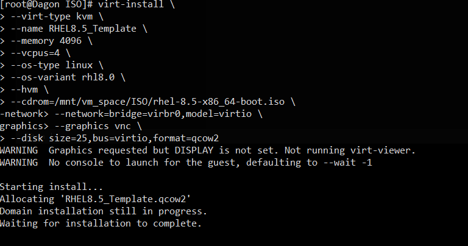
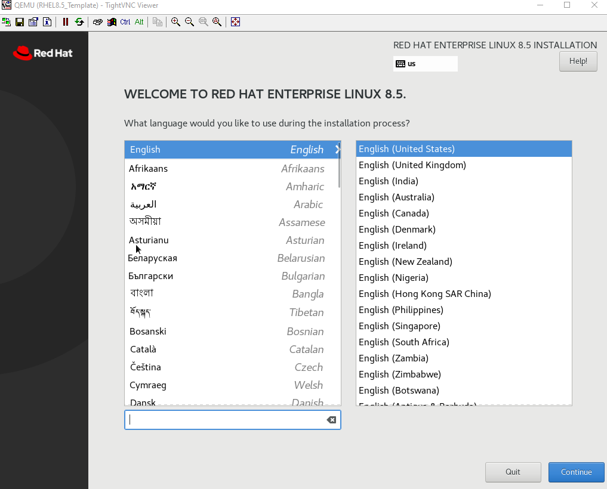
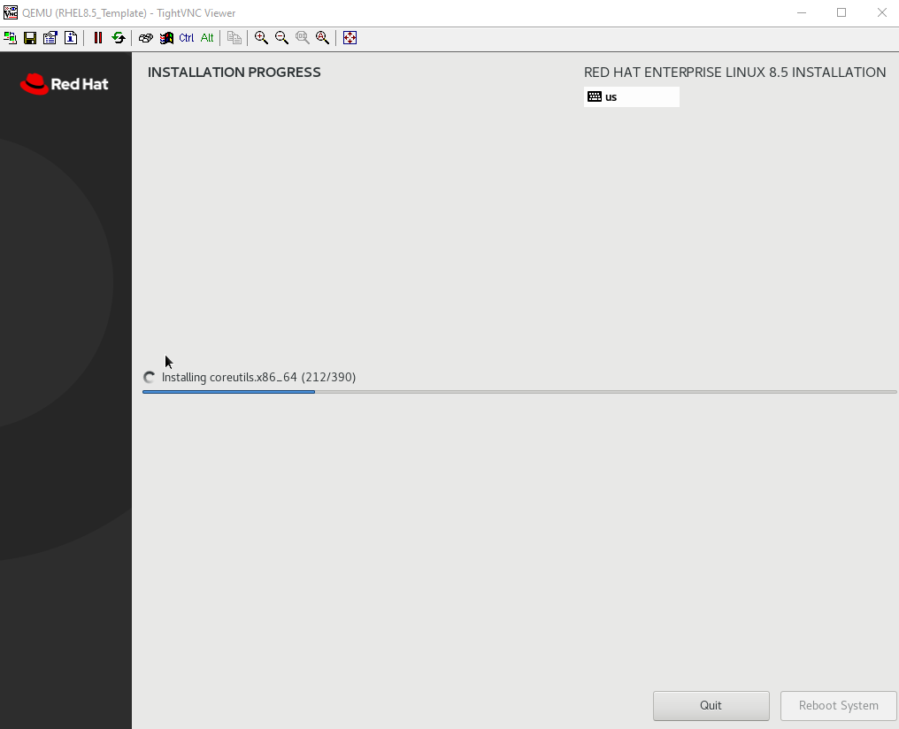
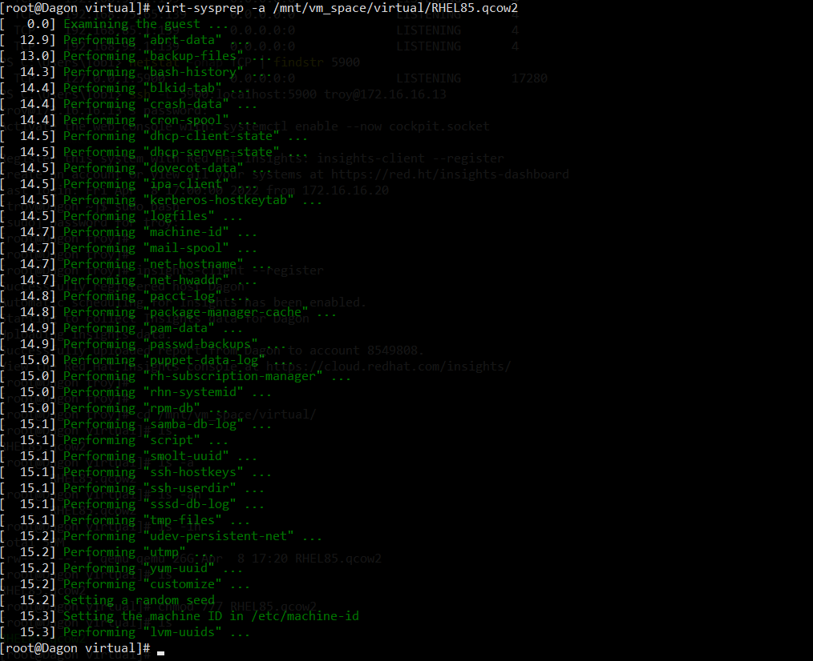
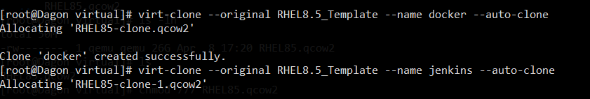

# Purpose: Will Track my RHEL build and clones

## Start (4/8/2022)

## Building network:

- will use default network since it's already there:

```xml
<network>
  <name>default</name>
  <uuid>cfc65372-1068-4a42-b571-11ba2b9d2103</uuid>
  <forward mode='nat'>
    <nat>
      <port start='1024' end='65535'/>
    </nat>
  </forward>
  <bridge name='virbr0' stp='on' delay='0'/>
  <mac address='52:54:00:2a:06:19'/>
  <ip address='192.168.122.1' netmask='255.255.255.0'>
    <dhcp>
      <range start='192.168.122.2' end='192.168.122.254'/>
    </dhcp>
  </ip>
</network>
```

- DHCP will be used for base OS 

## Building first vm(template):

**Prereq**
- virtualization not setup on server (prabably due to bios failure), fix with:

- Also use this to install additional managment tools!:

  https://computingforgeeks.com/how-to-install-kvm-on-rhel-8

  https://access.redhat.com/documentation/en-us/red_hat_enterprise_linux/8/html/configuring_and_managing_virtualization/getting-started-with-virtualization-in-rhel-8_configuring-and-managing-virtualization

  
```
cat /proc/cpuinfo | egrep "vmx|svm"
```


```
dnf -y install libvirt-devel virt-top libguestfs-tools
```
```
yum install virt-install virt-viewer
```

- Setup Storage Pool since the default one is not installed:

  https://access.redhat.com/documentation/en-us/red_hat_enterprise_linux/6/html/virtualization_administration_guide/sect-virtualization-storage_pools-creating-local_directories-virsh

- Pool setup complete

- Get OS variant for build:

```
osinfo-query os

# "rhl8.0" for RHEL 8
```


**Build**

https://access.redhat.com/documentation/en-us/red_hat_enterprise_linux/7/html/virtualization_deployment_and_administration_guide/sect-guest_virtual_machine_installation_overview-creating_guests_with_virt_install

scratch notes:
```
virt-install --virt-type kvm --name RHEL8.5_Template --memory 4096 --vcpus=4 --os-type linux --os-variant debiantesting --hvm --cdrom=/mnt/ISO/rhel-8.5-x86_64-boot.iso --network=bridge=virbr0,model=virtio --graphics vnc --disk path=/mnt/vm_space/virtual/rhel/rehl8amd64.qcow2,size=25,bus=virtio,format=qcow2
```

Below is command to perform build
```
virt-install \
--virt-type kvm \
--name RHEL8.5_Template \
--memory 4096 \
--vcpus=4 \
--os-type linux \
--os-variant rhl8.0 \
--hvm \
--cdrom=/mnt/vm_space/ISO/rhel-8.5-x86_64-boot.iso \
--network=bridge=virbr0,model=virtio \
--graphics vnc \
--disk size=25,bus=virtio,format=qcow2,path=/mnt/vm_space/virtual/RHEL85.qcow2
```

  

- waiting for install, thus I need to VNC into box... :

  

- Now proceeding with install
- Mininmal Install Selected
- Root Password set
- User created: bart  
- installing:

  

- Install Complete, rebooting

**Cloning**

  https://access.redhat.com/documentation/en-us/red_hat_enterprise_linux/8/html/configuring_and_managing_virtualization/cloning-virtual-machines_configuring-and-managing-virtualization

- Get IP of running machines (If they use DHCP)

```
net-dhcp-leases default
```

- Preparing the Machine for cloning with tutorial above
  - using "virt-sysprep", this seem to have worked:
    
  - Now Performing the actual clones
  - Making Two Clones for Now

  ```
  virt-clone --original RHEL8.5_Template --name docker --auto-clone

  ```

    

  - Clones completed, post config:
  ```
  hostname jenkins
  subscription-manager register
  subscription-manager attach
  ```
  - Verification: Both hosts are registered and have a different IP/hostname, good enough for a lab


## Conclusion: (4/8/2022)

- Succesfully Created RHEL 8 template vm image and cloned
- Created two clones one for docker and jenkins (will create more if neccessary)
- Ready for next phase


---
## Extra

**Quick Manual UnRegister/Register**:

```
## Before Cloning do this:
subscription-manager unregister
subscription-manager clean

## After Cloning do this:
hostname jenkins
subscription-manager register
subscription-manager attach
# optional:
insights-client --register
```

